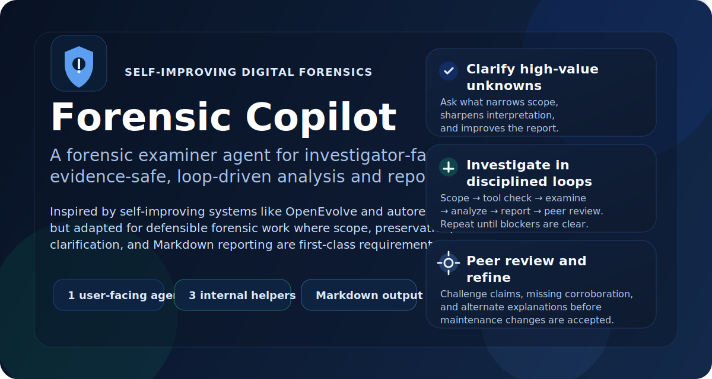
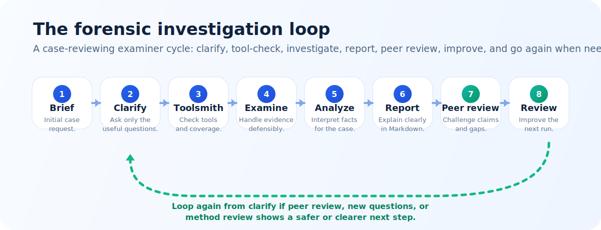

# Forensic Copilot



Forensic Copilot is a portable agent workflow for digital forensic triage, host review, disk-image work, and Markdown reporting.

It gives you one visible agent, **Forensic Examiner**, plus internal helper agents for platform profiling, tool research, provisioning, evidence collection, timeline analysis, report challenge, redaction, and offline script fallback.

Use it with real examiner judgment, your legal authority, and your local SOPs. It helps structure the work; it does not replace validation, chain of custody, or human review.

## Fast Start

Give the agent an evidence source and a question:

```text
Investigate /evidence/image.E01 for suspicious user activity and write reports/CASE-001.md.
```

For live authorized host triage:

```text
Analyze this authorized Windows host for user activity during the last two hours. Use low-impact read-only collection and write reports/CASE-001.md.
```

A bare path is enough to begin. The examiner should infer preservation-first, scope-limited triage, start a Markdown case record, and ask only the clarification questions that could materially change the result.

## What It Does

- keeps the report reader-first: summary, findings, then details
- preserves or inventories relevant in-scope artifacts, including sensitive ones
- separates observation, inference, limitation, and confidence
- picks tools through a senior tooling subagent instead of guessing
- profiles the evidence OS before OS-specific collection or tool choice
- can use optional specialized tool adapters through a loose local contract
- supports quick triage and deeper comprehensive examination
- works online, offline, or in enterprise environments with blocked downloads
- creates local fallback scripts only when needed, and only after review

## Supported Interfaces

| Interface | Best entry point |
| --- | --- |
| GitHub Copilot / VS Code | Select `.github/agents/forensic-examiner.agent.md` or `Forensic Examiner` |
| OpenCode | Use `opencode.json` and `opencode run --agent forensic-examiner ...` |
| Codex | Open the repo; Codex should read `AGENTS.md` |
| Claude Code | Use `CLAUDE.md`; optionally copy helpers into `.claude/agents/` |
| Gemini CLI | Use `GEMINI.md` |
| Open WebUI | Create a Workspace Model or Prompt from the examiner prompt |
| Other local wrappers | Load `AGENTS.md` plus `.github/agents/forensic-examiner.agent.md` |

Detailed setup is in [docs/interface-setup.md](docs/interface-setup.md).

## OpenCode Example

Choose the model explicitly for each OpenCode run. The repo does not pin a top-level model because provider availability is account-specific and local-model backends are environment-specific.

```bash
opencode run --agent forensic-examiner --model github-copilot/gpt-5.5 \
  "Investigate /evidence/image.E01 for suspicious user activity."
```

Local/offline model override example:

```bash
python scripts/check_opencode_llamacpp_backend.py --base-url http://LOCAL-GPU-HOST:8080 --smoke-tool-call --smoke-max-tokens 2048

OPENCODE_CONFIG_CONTENT='{"model":"llamacpp-local/gemma-heretic-bf16","small_model":"llamacpp-local/gemma-heretic-bf16"}' \
  opencode run --agent forensic-examiner --model llamacpp-local/gemma-heretic-bf16 \
  "Analyze this authorized host for user activity during the last two hours."
```

For llama.cpp-backed Gemma runs, reasoning can stay enabled. Make sure the backend and OpenCode output cap leave enough room for the visible tool call after thinking. A finite server budget such as `--reasoning on --reasoning-budget 1024` is usually easier to test than unrestricted hidden reasoning. If the preflight smoke test produces only hidden reasoning, raise the output cap or tune the reasoning budget before testing the subagent loop.

Model discovery and runtime support can differ by account. If a Copilot model is listed but rejected by the provider, treat that as a provider/account blocker, not an agent-loop failure.

## Offline and No-Download Mode

Offline use is first-class.

When web access, Copilot, GitHub, package managers, or downloads are unavailable, the workflow should fall back in this order:

1. local repo guidance and SOPs
2. installed forensic tools
3. native OS commands and APIs
4. generated standard-library scripts

Generated scripts are controlled evidence tooling. They cannot be used until:

- `forensic-script-author` creates the smallest read-only script needed
- `forensic-script-reviewer` performs static review, syntax validation, and dry-run or fixture validation
- script path, hash where practical, validation log, review status, and limits are recorded
- review returns `SCRIPT_REVIEW: approved-for-controlled-use`

See [docs/offline-usage.md](docs/offline-usage.md).

## Agent Loop



Only **Forensic Examiner** is user-facing.

The internal loop is:

1. `forensic-senior-tooling-specialist`
2. `forensic-platform-profiler` when OS, mode, filesystem/logging, host role, or runner boundary is unclear
3. `forensic-tool-researcher`
4. `forensic-tool-provisioner`
5. `forensic-script-author` and `forensic-script-reviewer` when tools cannot be fetched or used
6. `forensic-evidence-collector`
7. `forensic-artifact-router`
8. `forensic-timeline-analyst`
9. `forensic-report-challenger`
10. `forensic-peer-reviewer`
11. `forensic-publication-redactor`
12. `forensic-maintainer` only when reusable workflow changes are justified

The loop should not be bypassed. If a helper stalls or fails, retry the same helper path with a narrower prompt or restore the provider/backend before collecting evidence.

## Specialized Tool Adapters

Forensic Copilot can use specialized tool adapters when a case benefits from expert tooling, but those adapters are optional providers rather than hard dependencies.

The senior tooling specialist decides whether an adapter fits the evidence, platform, scope, authority, manual guidance, and local environment. Adapters should use local manifests, sanitized file-in/file-out calls, documented headless or API routes where possible, and local-only alias maps for sensitive identifiers.

X-Ways-MCP is the first documented example for X-Ways Forensics workflows such as E01 handling, case metadata triage, BitLocker-aware work, file carving, and X-Tension-based automation. It is not a required dependency and should not become a product-specific default lane. Other tools can follow the same adapter pattern when they add value.

See [docs/specialized-tool-adapters.md](docs/specialized-tool-adapters.md).

## Triage vs Comprehensive Work

Quick triage collects the minimum defensible source set needed to answer or prioritize the question.

Comprehensive examination preserves or inventories every relevant in-scope artifact class, including artifacts that are sensitive, hidden, encrypted, inconvenient, or likely to contain credentials. Sensitivity changes handling and disclosure; it does not make an artifact irrelevant.

Secret extraction can be a legitimate forensic step when it is inside the case authority and helps unlock evidence, identify additional victims, or prove access. Treat it as a controlled evidence lane: dump plaintext secrets only to approved, ignored case-output paths with provenance, hashes, tool details, and handling notes. Keep public repository content, ordinary prompts, and report prose redacted unless the case specifically requires a value to be disclosed. If the active AI interface, provider policy, system instruction, or enterprise rule does not allow plaintext secret handling, switch that part of the work to approved local tools or a local/offline model and record the provider or model change in the case report.

Extracted secrets should feed the next forensic loop. Classify each lead by source artifact, secret type, likely program/site/service, account or owner when known, local-versus-remote use, confidence, and controlled output path. Use local or otherwise in-scope secrets to unlock or collect additional evidence when authority and data-location boundaries allow it. For remote services, cloud accounts, or scope-expanding access, stop and give the user a redacted lead list plus the controlled secret-output path unless explicit authority already covers the login attempt.

## What To Provide

Helpful inputs:

- evidence path or live host scope
- approved input/read roots, including whether neighboring folders, derived exports, live state, key material, cloud, or network sources are in scope
- approved compute/staging roots for tools, generated scripts, working copies, extracted artifacts, temporary files, and whether local, remote, GPU, container, or cloud compute is allowed
- approved output/report/export roots for reports, logs, artifact exports, review packages, and redacted deliverables
- operating system, if known
- question to answer
- user, host, or account of interest
- time window and timezone
- authority or policy limits
- live vs mounted vs image status
- desired report path

If the operating system is not known, the platform profiler should establish the evidence OS before broad collection. It must distinguish the runner from the evidence source, for example WSL running commands against a Windows host or a Linux analyst workstation examining a macOS APFS image.

If some details are missing, the examiner should proceed with conservative assumptions and record them. A bare evidence path is enough to begin: treat that path as the input scope, use ignored analyst-controlled case/tool/artifact paths for compute and staging, and write only the requested report or a safe ignored report path. Ask before reading outside the input boundary, staging or caching on unapproved storage, using remote or cloud compute, or writing outside the approved output boundary.

## What You Get

The canonical output is a Markdown report with:

- executive summary
- findings and timeline correlations
- conclusions and confidence
- limitations and unresolved questions
- scope and assumptions
- evidence handling and verification notes
- tools, versions, commands, and validation notes

Formal exports can be generated after review. See [docs/formal-report-output.md](docs/formal-report-output.md).

## Repository Map

- [AGENTS.md](AGENTS.md) - compact repo-wide instructions
- [.github/agents/](.github/agents/) - Copilot-compatible agent profiles
- [docs/opencode-agents/](docs/opencode-agents/) - lean OpenCode prompts
- [docs/interface-setup.md](docs/interface-setup.md) - setup by AI interface
- [docs/offline-usage.md](docs/offline-usage.md) - offline and generated-script rules
- [docs/specialized-tool-adapters.md](docs/specialized-tool-adapters.md) - loose adapter pattern for expert forensic tools
- [docs/repository-policy.md](docs/repository-policy.md) - expanded policy
- [docs/tooling-matrix.md](docs/tooling-matrix.md) - tool-selection starting point
- [docs/privacy-and-redaction.md](docs/privacy-and-redaction.md) - publication hygiene
- [docs/assets/](docs/assets/) - README diagrams for the current platform-aware loop
- [scripts/validate_repo_hygiene.py](scripts/validate_repo_hygiene.py) - repo hygiene check
- [scripts/check_opencode_llamacpp_backend.py](scripts/check_opencode_llamacpp_backend.py) - local llama.cpp backend preflight for OpenCode tests
- [scripts/run_local_model_investigation_eval.py](scripts/run_local_model_investigation_eval.py) - local OpenCode/llama.cpp investigation regression runner

## Privacy

Keep published repo content generic. Do not commit real names, usernames, hostnames, employer names, client names, absolute local paths, live case outputs, evidence artifacts, screenshots, secrets, or case-specific hashes.

Use placeholders such as `CASE-001`, `ANALYST`, `HOST-A`, and `/evidence/image.E01`.

Before pushing changes, run:

```bash
python scripts/validate_repo_hygiene.py
```

## Source Basis

Forensic process and tool sources are tracked in [docs/sources.md](docs/sources.md). Interface setup guidance follows current official docs where available: GitHub README and Copilot custom-agent docs, VS Code custom-instruction docs, OpenAI Codex docs, Claude Code memory and subagent docs, Gemini CLI context docs, Open WebUI workspace docs, and OpenCode agent docs.
